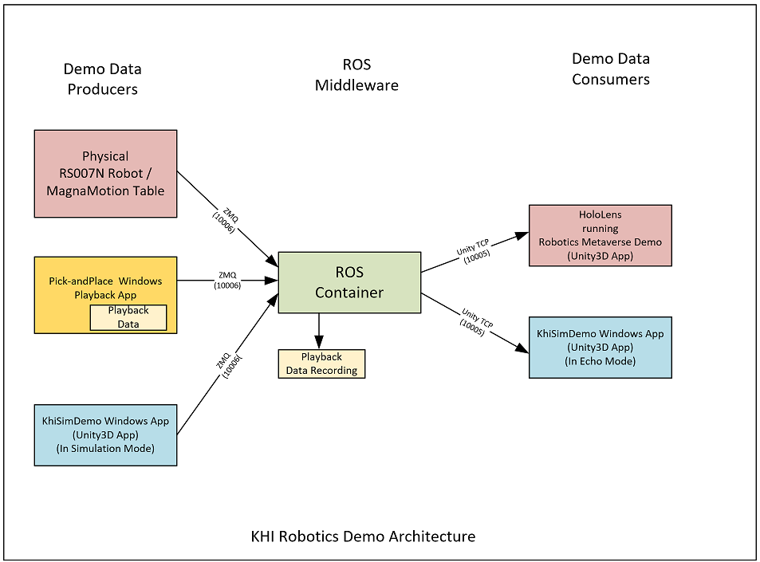

# Kawasaki-Rockwell RS007N/MagMo Robotics Demo - ROS Container Repo
 

There is a Unity3D app that simulates the Kawasaki RS007N Robot and Rockwell MagnaMotion track table demo for the HoloLens, that is featured in the Microsoft Build 2022 Keynote Demo (at the end of Satya Nadella's portion).

A link to the video (1:31): (https://www.youtube.com/watch?v=kFIM6vPLO9Y) - the HoloLens portion is from 1:00.

Note much of this code derived from the Unity Robotics Hub Pick-and-Place tutorial.

# Architecture
The overall demo logical architecture is as follows:

## Components 
The following components and their repos can be found here:

### Consumers
- Physical Robot and Table - the complete robot with the MagnaMotion table only exists in its complete form in Microsofts Houston Lab (ex-Marsden)
- Pick-and-place Playback Tool - a Windows 11 App, code can be found in following repo:()
- KhiSimDemo App - A Unity3D App for Windows, code can be found in following repo:()

### Middleware
- ROS Container - up-to-date code can be found in tihs repo:()
- Cloud version - and older version of the code with instructions for installing in various places (on an Azure VM, as an ACI) can be found here:()

### Consumers
- Hololens App - Robotics Metaverse Demo, app can be found in Windows Store, code can be found in following repo:()
- KhiSimDemo App - A Unity3D App for Windows, code can be found in following repo:()

Note: KhiSimDemo App is the same application, just running in different modes. For more information see its repo.

# Getting started
- prerequisites are Windows 10 or 11, Docker Desktop and Unity
- This probably can be built on other systems like Ubuntu of MacOS as well but we have not tested that.
- You will want to build the ROS Docker images 
   - we have scripts to build and run them for ROS1: Melodic and Noetic
   - we are looking to build them for ROS2: Foxy but they are not done yet

## Docker
- Start `Docker Desktop` (you should see the whale in the Windows tray)
- change to repository root directory

### ROS1 - Melodic
- To build docker image: `makemelodic.bat`
	- if successful you should be able to see a new image with `docker images`
- To run image: `startmelodic.bat`
    	- should see the `..../catkin_ws#` prompt

### ROS1 - Noetic
- To build docker image: `makenoetic.bat`
	- if successful you should be able to see a new image with `docker images`
- To run image: `startnoetic.bat`
      - should see the `..../catkin_ws#` prompt
      - you can then start a launch file for example with `. devel/rs007_launch.txt`
      
- To open a second window enter:
      - `newroswindow.bat`
      - `. devel\setup.bash`
      - `rosnode list`
      

## Compiling the Unity Project
- The Unity Project has been moved to its own repository `KhiSimeDemo` 
- See this repo for instructions on how to build that
